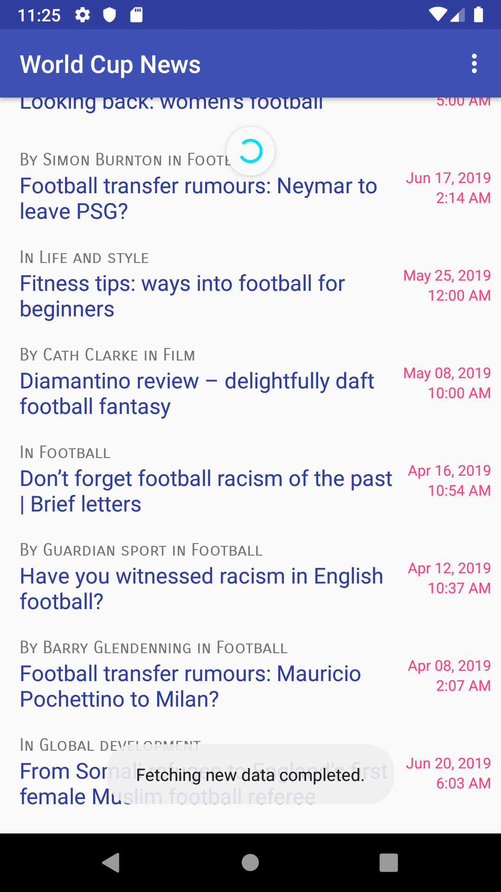
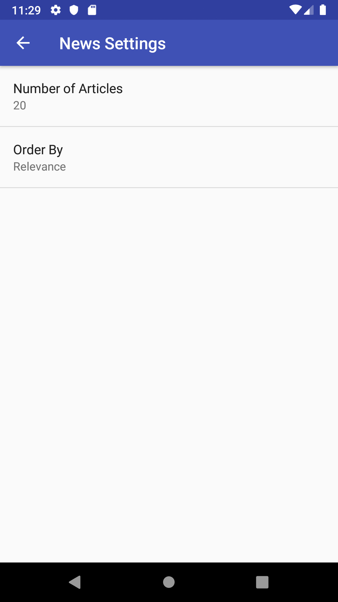

# WorldCupNews - Android
A simple android application that uses The Guardian API to pull the latest news related to World Cup.

## How to use
You just need to add the Gurdian API key intp the `gradle.properties` file as following 

`guardianAPIs_ApiKey="YOUR-API-KEY-HERE"`

## Features
* Pull to refresh
* Simple settings panel to set the number of news articles and the order preference

 